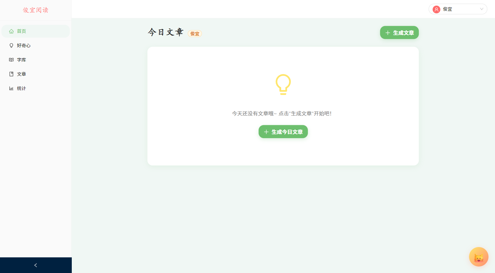

# 俊宜阅读 — AI 驱动的儿童中文阅读应用

自动生成适配孩子阅读水平的短文，拼音标注、语音朗读、生字分区管理和好奇心问答引擎。

## 亮点

- **AI 生成文章** — 不是固定题库，每次实时创作，适配认知水平。支持自定义主题、生字、字数、摘要
- **家长模式** — 精细控制生字密度（1-20 个/百字）、复习比例、文章字数，实时查看字库数据
- **点字发音** — 每个汉字标注拼音，点击即读，Edge-TTS 高音质 + 浏览器语音兜底
- **生字四区** — 学习区/观察区/掌握区/遗忘区自动流转，点读降级、自然习得晋升全自动
- **好奇心问答** — 孩子提问，AI 回答；复杂话题自动拆分章节，LangGraph 多步编排
- **多学生支持** — 切换学生，每人独立学习记录和进度



## 快速开始

```bash
# 开发环境（前端 :3002, 后端 :8002）
bash scripts/start-dev.sh

# 正式环境（前端 :3001, 后端 :8001）
bash scripts/start-prod.sh
```

**首次设置**：MySQL 创建数据库 → 复制 `backend/.env.example` 为 `backend/.env` 填密钥 → 虚拟环境 `pip install -r requirements.txt` → 前端 `npm install`。

## 技术栈

| 层 | 技术 |
|---|------|
| 后端 | FastAPI + SQLAlchemy + MySQL |
| 前端 | React 18 + TypeScript + Vite + Ant Design 5 + Zustand |
| AI | DeepSeek (LLM), Edge-TTS (语音), CogView (图片) |
| 编排 | LangGraph StateGraph（好奇心系列问答） |
| 移动端 | Capacitor 8 (Android 打包) |

## 使用指南

详细操作说明见 [使用指南.md](使用指南.md)

## 项目结构

```
├── backend/app/
│   ├── main.py           FastAPI 入口
│   ├── config.py          环境配置 + 认知分级系统
│   ├── models/            ORM 模型
│   ├── domains/           领域模块（router → service → repository）
│   │   ├── articles/      文章生成/历史/已读
│   │   ├── characters/    生字四区 + 自动晋升引擎
│   │   ├── curiosity/     好奇心问答 + LangGraph
│   │   └── tts/           语音合成
│   └── ai/                AI Provider 抽象层
├── frontend/src/
│   ├── pages/             页面组件
│   ├── components/        通用组件 + 阅读器
│   ├── store/             Zustand 状态管理
│   └── services/          API 封装
└── scripts/               启动脚本
```
