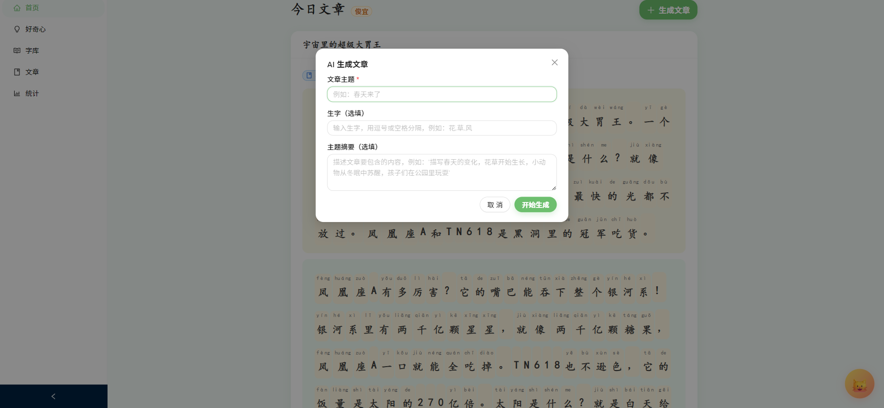
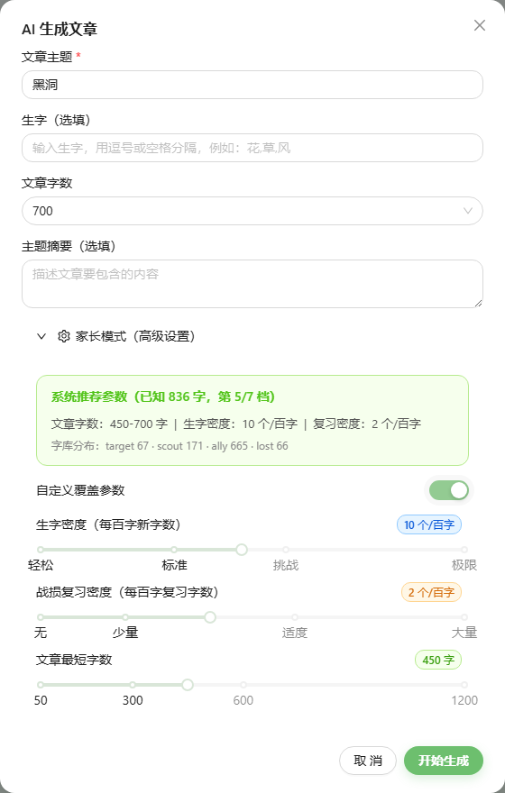
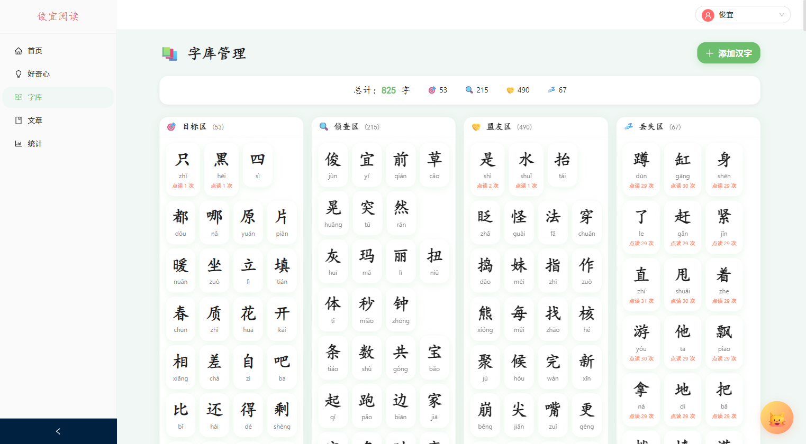
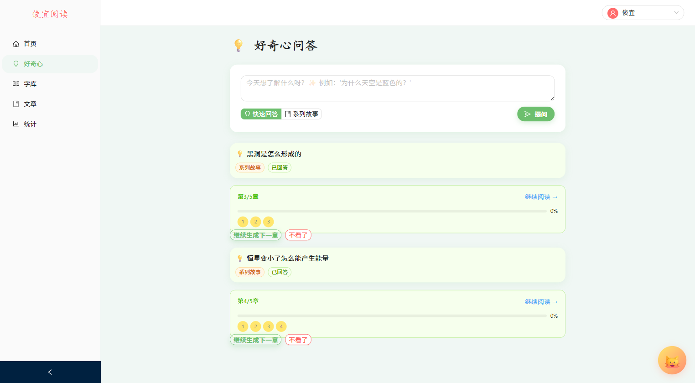
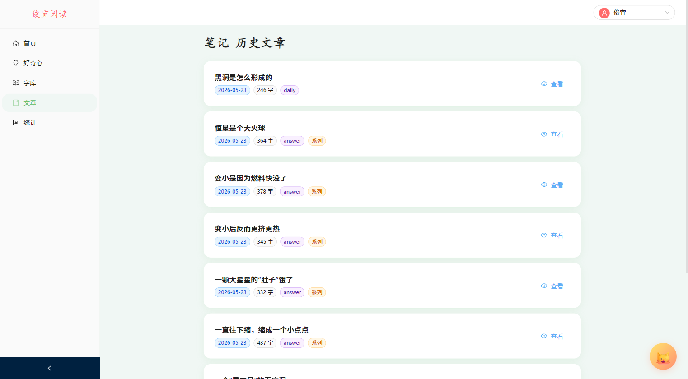
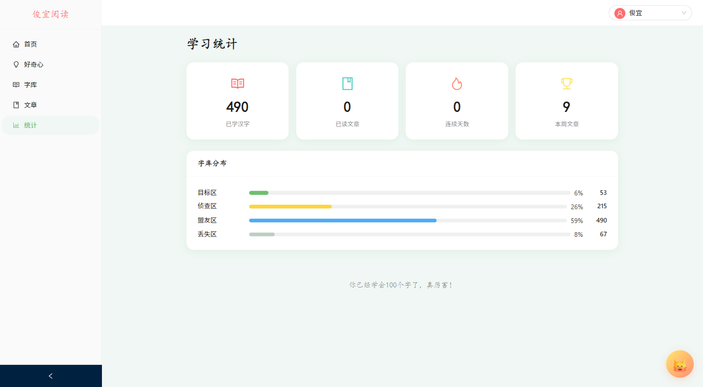

# 俊宜阅读 — 使用指南

俊宜阅读是一款 AI 儿童中文阅读工具。它可以自动生成适合孩子阅读水平的短文，给生字标注拼音，还能点击汉字听发音，帮助孩子在学习生字的过程中逐步掌握。

---

## 一、打开应用

1. 确认电脑上已启动服务（通常自动运行）
2. 打开浏览器，访问：**http://localhost:3001**

进入后看到的是**首页**，左侧是导航菜单，右侧是内容区域。

---

## 二、认识页面

整个应用分为 **5 个页面**，通过左侧菜单切换：

| 菜单 | 图标 | 用途 |
|------|------|------|
| 首页 | 🏠 | 查看今日文章，生成新文章 |
| 好奇心 | 💡 | 孩子问问题，AI 来回答 |
| 字库 | 📖 | 查看和管理学习的生字 |
| 文章 | 📚 | 查看以前读过的所有文章 |
| 统计 | 📊 | 看学习进度和数据 |

顶部右侧显示**当前学生**，可以点击切换不同学生。

---

## 三、亮点功能

### 亮点一：AI 生成文章

这是一大亮点。不是从固定题库里凑文章，而是 **AI 实时创作**，每次生成的内容都不一样，且**自动适配孩子的阅读水平**。

点击「生成文章」按钮，弹出窗口支持丰富的定制：

| 设置项 | 说明 | 示例 |
|--------|------|------|
| **文章主题** * | 想让孩子读什么？ | "春天"、"恐龙"、"太空" |
| **生字** | 指定要练习的汉字 | "花, 草, 风" |
| **文章字数** | 选择篇幅长短 | 30 字 ~ 1200 字 |
| **主题摘要** | 描述希望包含的内容 | "讲种子发芽的过程" |

填好点击「开始生成」，AI 会在 10-30 秒内写出一篇注音文章。

### 亮点二：家长模式

这是另一大亮点。展开生成文章弹窗底部的「家长模式（高级设置）」，可以对文章进行**精细化控制**：

- **系统推荐参数**：根据孩子当前字库情况（已知多少字、各区域分布），自动推荐最佳的生字密度和文章长度
- **生字密度滑块**（1-20 个/百字）：控制每 100 个字里出现多少个新字，轻松→标准→挑战→极限
- **战损复习密度滑块**（0-5 个/百字）：控制每 100 个字里混入多少需要复习的"遗忘区"字
- **文章最短字数**（50-1200 字）：精确控制文章长度

系统还会实时显示当前字库数据（学习区/观察区/掌握区/遗忘区各有多少字），以及今日新学了哪些字，让家长心里有数。

---

## 四、日常使用步骤

### 第 1 步：生成文章

1. 点击左侧「首页」
2. 点击「生成文章」按钮
3. 在弹窗中输入**主题**（必填），可选填生字、调整字数、写摘要
4. 需要精细控制时，展开底部「家长模式」调整密度参数
5. 点击「开始生成」，等待 AI 写出文章（约 10-30 秒）

### 第 2 步：阅读文章

文章生成后，会显示在首页上：

- 每个字都有**拼音**标注
- **点击汉字**可以听到发音
- 读完一段后，点「下一段」继续
- 全部读完后，系统会自动记录进度

### 第 3 步：学习生字

点击左侧「字库」，可以看到四个区域：

| 区域 | 含义 | 颜色 |
|------|------|------|
| 学习区 | 正在学习的字 | 🔴 红色 |
| 观察区 | 新接触的字，待观察 | 🟡 黄色 |
| 掌握区 | 已经学会的字 | 🟢 绿色 |
| 遗忘区 | 需要复习的字 | ⚫ 灰色 |

**字会自动移动**：系统会根据孩子的点击和阅读情况，自动把字从一个区移到另一个区。比如一个掌握区的字被多次点击，说明还没掌握，会自动回到学习区。

### 第 4 步：提问和探索

点击左侧「好奇心」，可以：

1. **直接提问**：在输入框里输入孩子的问题（比如"为什么天是蓝色的？"），AI 会生成回答
2. **系列学习**：对于复杂的问题，AI 会分成多个章节来讲解，像小故事书一样

### 第 5 步：查看历史文章

点击左侧「文章」，可以看到之前读过的所有文章，点击「👁 查看」可以重新阅读。

### 第 6 步：看学习统计

点击左侧「统计」，可以看到：

- 学习了多少字
- 各区生字的数量
- 阅读了多少篇文章

---

## 五、小提示

- **拼音标注**：文章中的生字都会自动标注拼音，认识的字可以不标
- **点字发音**：阅读时随时点击任何汉字，系统会读出标准发音
- **学生切换**：如果家里有多个小朋友，可以点击右上角切换学生，每人有独立的学习记录
- **生成速度**：AI 生成文章需要 10-30 秒，请耐心等待
- **移动端**：也可以在 Android 手机上安装使用（需要单独打包）
